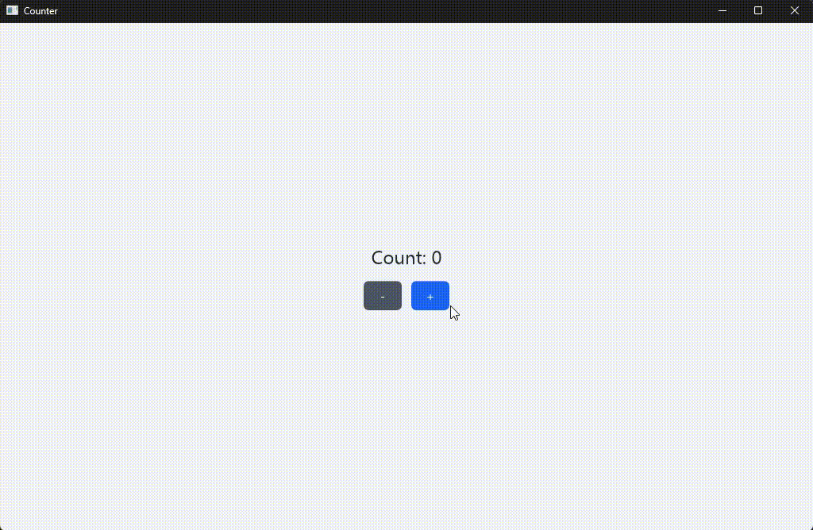

# NowUI

**A native UI toolkit for Rust, styled the way the web already thinks in.**

NowUI lets you describe an application's interface in a small, declarative
markup — a Tailwind-flavored styling vocabulary over a simple widget tree —
and back it with plain Rust state. No browser, no JavaScript runtime, no
webview. Just a compact file format, a fast layout engine, and a GPU-accelerated
renderer underneath, producing a real native window at a steady 60 frames per
second.

If you've styled something with utility classes before, NowUI's markup will
feel immediately familiar. If you know Rust, wiring it up to real application
logic will feel just as familiar. That's the point: two things you already
know, put together.

---

## Why NowUI

- **Utility-first styling, without the web.** Spacing, color, typography,
  flexbox, grid, borders, transforms, and transitions — expressed in the same
  compact, composable classes popularized by modern CSS frameworks, applied
  directly to native widgets.
- **Real Rust state, not a scripting bridge.** Your application's data model
  is a plain Rust struct. A single derive macro connects it to the UI —
  bindings and event handlers resolve straight into your own methods, with no
  serialization layer or intermediate language in between.
- **Live reactivity.** Text, values, and entire sections of the interface —
  conditional branches, repeated lists — update automatically as your state
  changes, every redraw.
- **GPU-accelerated by default.** Rendering runs on a modern `vello`/`wgpu`
  pipeline, with a CPU fallback available for constrained environments.
- **Fast iteration.** Load your interface definition straight from disk while
  you design it, then bundle it directly into the compiled binary for
  distribution — no separate assets to ship, no runtime file access required.
- **Editor support out of the box.** A dedicated language server brings
  syntax highlighting and live diagnostics for the NowUI markup to VS Code.

---

## A complete example: a counter

Below is an entire working application — a window with a live count and two
buttons — split across the two halves of NowUI: the Rust state that owns the
logic, and the view that describes how it looks and what it reacts to.

### The state (Rust)

```rust
//! End-to-end reactivity example: a real `#[derive(NowUiState)]` app-state
//! struct backing `examples/counter.nowui`'s `{value: state.counter.count}`
//! and `{onClick: state.counter.increment}` bindings.
//!
//! Run:  cargo run -p nowui-runtime --example counter

use std::process::ExitCode;

use nowui_core::{Event, NowUiState};

#[derive(Default, Clone, NowUiState)]
struct AppState {
    counter: Counter,
}

// Callable methods aren't discovered from the `impl Counter` block below —
// derive macros never see it — so they're listed explicitly here.
#[derive(Default, Clone, NowUiState)]
#[nowui(methods(increment, decrement))]
#[nowui(root(AppState))] // exposes to the nowui your root app struct, which allows for you to manage state from the top down instead of only just the struct that receives the function call
struct Counter {
    count: i64,
}

impl Counter {
    fn increment(&mut self, app:&mut AppState, _event: &Event) {
        self.count += 1;
    }

    fn decrement(&mut self, app:&mut AppState, _event: &Event) {
        self.count -= 1;
    }
}

fn main() -> ExitCode {
    let nowui_file = concat!(env!("CARGO_MANIFEST_DIR"), "/examples/counter.nowui");
    nowui_runtime::run_path("Counter", nowui_file, "App", AppState::default())
}

```

### The view (NowUI)

```nowui
layout: App w-[fill] h-[fill] items-center justify-center gap-4 bg-gray-100 {
  Text `Count: ${state.counter.count}` text-2xl font-semibold text-gray-800
  Container row gap-3 {
    Button `-` w-[48px] text-center text-white bg-gray-600 rounded py-2 {onClick: state.counter.decrement}
    Button `+` w-[48px] text-center text-white bg-blue-600 rounded py-2 {onClick: state.counter.increment}
  }
}
```



That's the whole app. `state.counter.count` in the view resolves straight
through to the `Counter` struct's `count` field on every redraw; each
`onClick` calls the matching method on it directly. No event bus, no manual
re-render calls, no glue code to maintain by hand.

Run it with:

```sh
cargo run -p nowui-runtime --example counter
```

---

## Getting started

A NowUI application is just a Cargo project. Add the runtime crate, derive
`NowUiState` on your application's state, and point it at a view file:

```toml
[dependencies]
nowui-core = { path = "../nowui-core" }
nowui-runtime = { path = "../nowui-runtime" }
```

From there, you have two ways to ship a view:

- **Load from disk** while you're designing — edit the `.nowui` file and
  re-run without recompiling.
- **Bundle into the binary** for release — annotate your state struct with
  `#[nowui(view("/your_view.nowui"))]` and the view compiles straight into the
  executable, with nothing left to distribute alongside it.

## Editor support

The `nowui-extension` VS Code extension, backed by a real language server
(`nowui-lsp`), brings syntax highlighting and inline diagnostics to `.nowui`
files as you write them.

## Learn more

For the full styling vocabulary, widget reference, and the architecture
underneath NowUI, see [`CLAUDE.md`](CLAUDE.md).


## To Bundle the view into the binary do this instead for the counter app

```rust
use std::process::ExitCode;
use nowui_core::{Event, NowUiState};

#[derive(Default, Clone, NowUiState)]
#[nowui(view("/examples/counter.nowui"))] // path is resolved relative to this crate's own `src/` directory, i.e. `src/examples/counter.nowui`
struct AppState {
    counter: Counter,
}

// Callable methods aren't discovered from the `impl Counter` block below —
// derive macros never see it — so they're listed explicitly here.
#[derive(Default, Clone, NowUiState)]
#[nowui(methods(increment, decrement))]
#[nowui(root(AppState))]
struct Counter {
    count: i64,
}

impl Counter {
    fn increment(&mut self, app:&mut AppState, _event: &Event) {
        self.count += 1;
    }

    fn decrement(&mut self, app:&mut AppState, _event: &Event) {
        self.count -= 1;
    }
}

fn main() -> ExitCode {
    nowui_runtime::run( "Counter", "App", AppState::default())
}
```